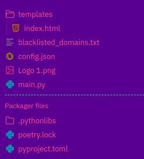
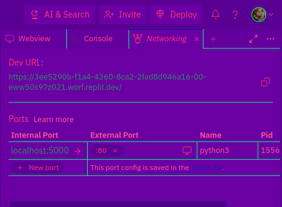

# Google Dork Movie Search

Google Dork Movie Search is a Flask web application designed to simplify the process of searching for movie-related content using Google dorks. It provides users with a straightforward interface to input movie details and search criteria, fetching relevant search results from Google. Additionally, it integrates a security feature powered by the VirusTotal API to scan retrieved URLs for potential threats, ensuring a safer browsing experience.

## If You like it please give it a star ⭐

## Features

- **User-friendly Interface:** Enjoy a clean and intuitive interface for inputting movie details and search criteria.
  
- **Google Dork Integration:** Leverage Google dorks to refine search results and find movie-related content efficiently.

- **VirusTotal Integration:** Ensure browsing safety by scanning retrieved URLs for potential security threats using the VirusTotal API.

## Getting Started

### Prerequisites

To run Google Dork Movie Search, you need the following dependencies:

- Python 3.x
- Flask
- BeautifulSoup
- requests

### Installation

1. Clone the repository:

    ```bash
    git clone https://github.com/Wuhpondiscord/movie-search.git
    ```

2. Install dependencies:

    ```bash
    pip install -r requirements.txt
    ```

## Usage

To use the application locally, follow these steps:

1. Navigate to the project directory:

    ```bash
    cd movie-search
    ```

2. Run the application:

    ```bash
    python app.py
    ```

## Deployment on Replit

To deploy the application on Replit, follow these steps:

1. Visit [Replit](https://replit.com/) and create or log in to your account.

2. Create a new Python REPL.

3. Copy the contents of `main.py` into the `main.py` file in your Replit project.

4. Create a folder named `templates` and add `index.html` to it.

5. Upload `config.json` and `blacklisted_domains.txt` to the root directory of your Replit project.

6. Your project files should look something like this:

    

7. Open the `index.html` file in the `templates` folder and change the URL for the favicon image in line 7 and the logo image in line 120 from "imageurlhere" to your desired URLs.

8. Open the networking section in the top right corner:

    

9. Set the external port to `80`.

10. Press the "run" button.

11. Retrieve the URL to the site from the networking section.

## Customization

- **Replit Theme:** If you prefer the Replit theme showcased in the images, you can download it [here](https://replit.com/theme/@wuhpondiscord/wuhp).

## Contribution

Contributions are welcome! Please feel free to submit pull requests or open issues for feature requests, bug fixes, or general improvements.
